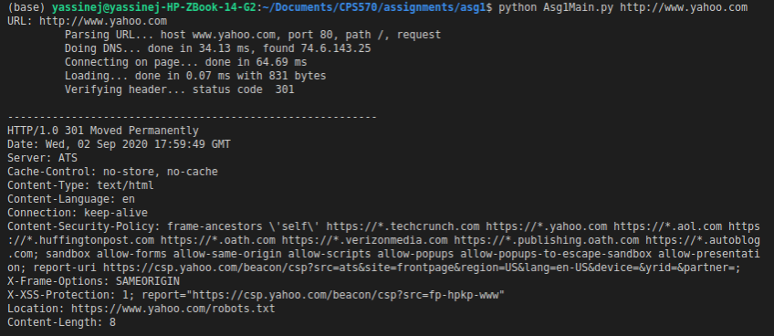
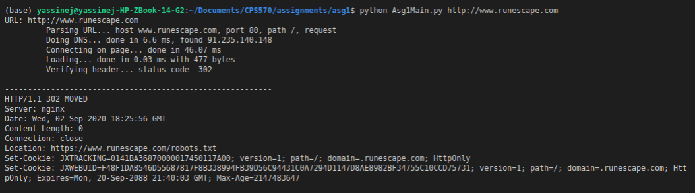
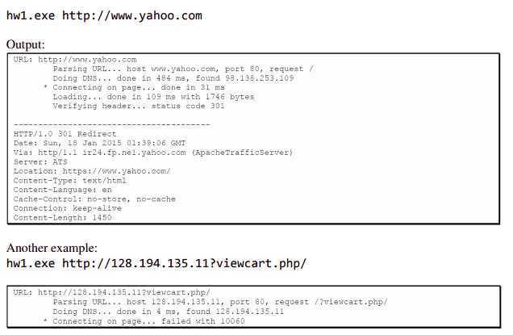

## Usage:

Use the following command to run the code:

```bash
python Asg1Main.py http://www.yahoo.com
```

Include any link to check for appropriate errors by changing the argument in the above command.

## ToDo list status:

The code for this assignment needs to meet the following items to meet a perfect score.

:construction: Include this emoji if currently working on it to avoid overlap

| **Function**  | **Points**  | **Break down**  | **Item**  | **Status** |
|---------------|-------------|-----------------|-----------|----------------|
|   **Input**   |  1 |  1 | No usage info if incorrect args  |      :heavy_check_mark:         |
|  **Request**  |  3 |  1<br />1<br />1<br />| Correct GET syntax<br />Hostname in rqst<br />User agent in rqst<br />| :heavy_check_mark:<br />:heavy_check_mark:<br /> :heavy_check_mark: <br />  |
|**Receive loop**| 4  | 1<br />2<br />1<br />  |  Dynamic buffer resizing<br /> Fails to receive/parse 96MB file<br /> Select()<br />  |  <br />:heavy_check_mark:<br /><br /> |
|  **Output**  | 10  | 3<br />1<br />1<br />1<br />1<br />1<br />1<br />1<br />  | Correct host/port/rqst<br />Correct DNS info<br />Timing of connect()<br />Timing of recv()<br />Correct page size<br />Correct HTTP status<br />Correct number of links<br />Correct HTTP header shown<br />   | :heavy_check_mark:<br />:heavy_check_mark:<br />:heavy_check_mark:<br />:heavy_check_mark:<br /><br />:heavy_check_mark:<br /><br />:heavy_check_mark:<br />  |
|  **Errors**  | 6  | 1<br />1<br />1<br />1<br />1<br />1<br />  | Handle invalid port/scheme<br />Notify of DNS failure<br />Notify of connect failure<br />Notify of recv() failure<br />Notify of non-HTTP reply <br />Parses non-2xx pages<br />  | :heavy_check_mark: <br />:heavy_check_mark:<br />:heavy_check_mark:<br />:heavy_check_mark:<br />:heavy_check_mark:<br /><br />  |
|  **Other**  | 1  | 1  | No Missing files for compilation  | :heavy_check_mark:  |


## Code Output:

Output code of running different websites:

```bash
python Asg1Main.py http://www.yahoo.com
```



```bash
python Asg1Main.py http://www.runescape.com
```



```bash
python Asg1Main.py http://www.128.194.135.11?viewcart.php/
```


## Goal of this part 1 of the assignment:


