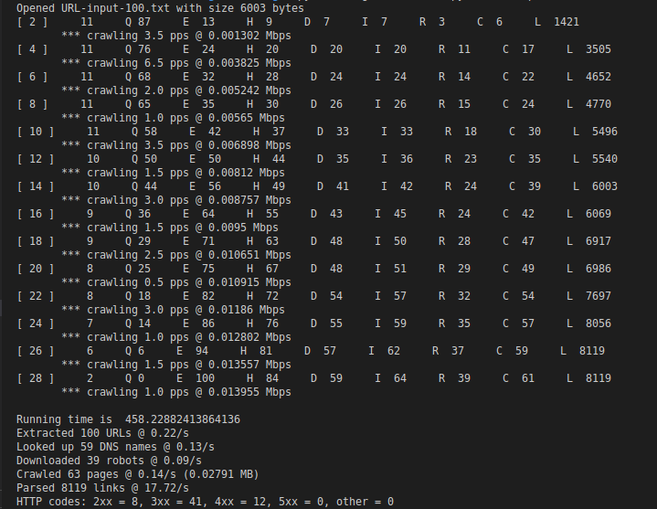
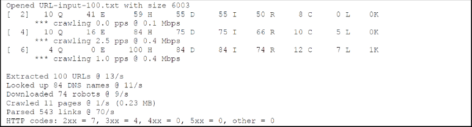

## Team Members:
* Yassine Jaoudi
* Samuel Akpan
* Samantha Clark

## Usage:

Use the following command to run the code:

```bash
python Asg1CrawlThread.py 10 URL-input-100.txt
```

The code accepts two arguments, first one indicates the number of threads to run and the second one the input file

## Requirements:

Python 3 with the packages included in the [requirements](CPS570/assignments/asg1/requirement.txt) file, use the following command to install:

```bash
pip install -r requirements.txt
```

## ToDo list status:

The code for this assignment needs to meet the following items to meet a perfect score.

* :construction: Include this emoji if you choose to work on the appropriate task
* :recycle: Include if this task is done, but it needs to be rechecked by another teammate
* :heavy_check_mark: Include this one if its done


:rotating_light::rotating_light::rotating_light: Choose the interesting tasks you would like to work on.

| **Function**  | **Points**  | **Break down**  | **Item**  | **Samantha** | **Samuel** | **Yassine** | 
|---------------|-------------|-----------------|-----------|--------------|------------|-------------|
|  **Running Output**  | 5  | 1<br />1<br />1<br />1<br />1<br />  | Printouts every 2 seconds<br />Correct active threads<br />Correct attempted robots<br />Correct pps<br />  Correct Mbps<br />   | :heavy_check_mark:<br />:construction:<br /><br /><br /><br /> | <br /><br />:construction:<br /><br /><br /> | <br /><br /><br />:construction:<br />:construction:<br /> | 
|  **Summary**  | 6  | 1<br />1<br />1<br />1<br />1<br />1<br />  | Correct URL processing rate<br />Correct DNS rate<br />Correct robots rate<br />Correct crawled rate/totals<br />Correct parser speed <br />Correct HTTP breakdown <br />  | :construction: <br />:construction:<br /><br /><br /><br /><br /> | <br /><br />:construction:<br />:construction:<br /><br /><br />  |  <br /><br /><br /> <br /> :construction:<br />:construction:<br /> |
|**Code**| 6  | 1<br />1<br />2<br />1<br />1<br />  |  >>20Mbps w/ 500 threads <br /> >>200MB RAM w/500 threads<br /> No deadlocks on exit<br />No issues with the file reader <br /> No improper stats thread<br />  | <br /><br /><br /><br /><br />  | <br /><br /><br /><br /><br /> |  <br /><br /><br /><br /><br /> |
|  **Other**  | 1  | 1  | No Missing files for compilation  |  |   |   |
|  **Report**  | 25  | 5<br />5<br />5<br />5<br />5<br />  | Lessons learned and trace<br />Google graph-size analysis<br />Yahoo band-width analysis<br /> Probability analysis<br /> Written Report<br />  | :heavy_check_mark: <br />:heavy_check_mark: <br />:heavy_check_mark:<br />:heavy_check_mark:<br />:heavy_check_mark:<br /> |:heavy_check_mark: <br /> <br /><br /><br />:heavy_check_mark:<br /> |:heavy_check_mark: <br /> <br /><br /><br />:heavy_check_mark:<br /> |


## :bug: Bug Fixes :bug: :

| **Bug** | **Status** | **Fix Implemented** | **Fixed by** |
|---------|------------|---------------------|--------------|
|  I, R, and L is not incremented throughout the 2 seconds |  :heavy_check_mark:  | Used an integer inside a list due to the fact that lists are mutable and not integers | **YJ**  |


## Code Output:


## Goal of this part 2 of the assignment:
### hw1.exe 10 URL-input-100.txt


## Lessons learned and trace:
* Git version control has been utilized and learned from the team members for better collaboration.
* Team building aspects and workflow has been learned as we have a great team that is motivated to do the work, be there when another member of the team needs help with a certain task, and finish with great results.
* Frequent and great communication throughout the team using zoom meeting or group chat.
* Debbuging techniques.
* Time management.
* Single-Threading/Multi-Threading concepts
* GET Request procedures
* Parsing webpages
* TCP Socket procedures
* DNS lookups
* Robot checks
* HTTP code meanings
* Verifying unique hosts and IP addresses


## Google graph-size analysis:
* Average number of links per HTML page that came back with a 2xx code: <br /> 
Total number of links = 8119 <br /> 
Number of pages with 2xx = 8 <br /> 
8119 / 8 = 1,014.875 <br /> 
<br /> 
* Google webgraph solution: <br /> 
1 T <br /> 
Each node has a list of neighbors: 1,014.875 <br /> 
1 T x 1,014.875 edges x (64/8) = 8.119 T/bytes
## Yahoo bandwidth analysis:
* Average page size in bytes:  <br /> 
10 billion pages per day (10 x 10^9) <br /> 
Number of bytes per page = 2K <br /> 
Bandwidth = bytes / seconds in a day  <br /> 
Bandwidth = (2K x 10^10) / (24 x 60 x 60) = (2K x 10^10) / 86,400 = 231,481,481.4814815 bytes/sec  <br /> 

## Probability analysis:
* The probability that a URL in the input host contains a unique host:  <br /> 
Number of unique hosts / total number of links in the input file  <br /> 
61 / 100 = 0.61  <br />
<br />
* Probability that a unique host has a valid DNS record:  <br />
Size of unique IP addresses / Number of unique hosts  <br />
66 / 61  = 1.08 <br />
 <br />
* Percentage of contacted sites had a 4xx robots file: <br />
 (Number of total unique IP addresses - Number of robots) / Total of unique IP addresses  <br />
 (66 - 43) / 66 = 0.35
  <br />


## :sparkles: Future Work :sparkles:

* Current code runtime is **458.23 ms**, we will be improving this runtime by making the code more effecient in order to decrease the runtime.
* Improve the overall design of the code. 
