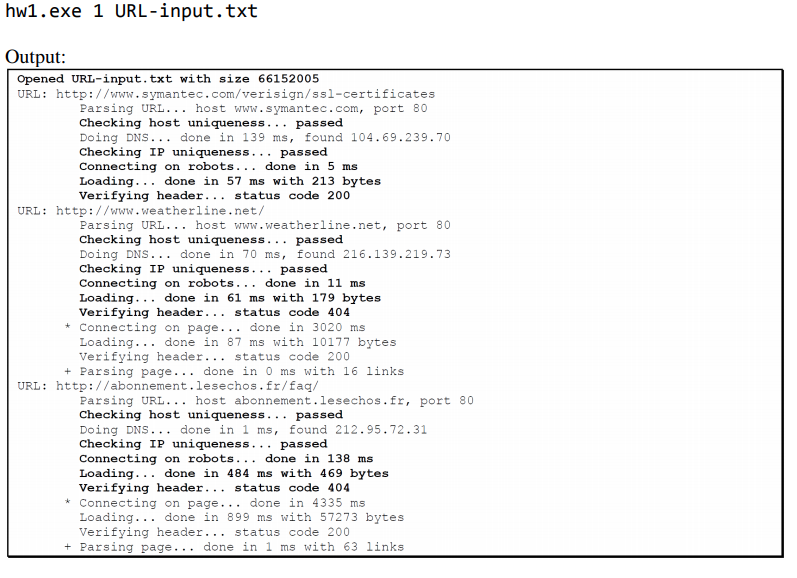

## Team Members:
* Yassine Jaoudi
* Akpan, Samuel Cyril
* Samantha Clark

## Usage:

Use the following command to run the code:

```bash
python Asg1CrawlThread.py 1 URL-input-100.txt
```

The code accepts two arguments, first one indicates the number of threads to run and the second one the input file

## ToDo list status:

The code for this assignment needs to meet the following items to meet a perfect score.

* :construction: Include this emoji if you choose to work on the appropriate task
* :recycle: Include if this task is done, but it needs to be rechecked by another teammate
* :heavy_check_mark: Include this one if its done


:rotating_light::rotating_light::rotating_light: Choose 4 or 5 tasks within the output and logic function as the other functions are either already implemented or are a quick fix just to split the work fairly.

| **Function**  | **Points**  | **Break down**  | **Item**  | **Samantha** | **Samuel** | **Yassine** | 
|---------------|-------------|-----------------|-----------|--------------|------------|-------------|
|  **Output**  | 11  | 1<br />1<br />1<br />1<br />1<br />1<br />1<br />1<br />1<br />2<br />  | Show Input file size<br />Correct URLs being crawled<br />Correct DNS results<br />Print host checks<br />Print IP checks<br />Timing of robots connect()<br />Timing of robots recv()<br />Correct robots page size<br />Correct robots HTTP status<br />Correct page download results<br />  | <br />:heavy_check_mark:<br />:heavy_check_mark:<br />:heavy_check_mark:<br /><br /><br /><br /><br /><br /><br /> | :heavy_check_mark:<br /><br /><br /><br /><br />:heavy_check_mark:<br />:heavy_check_mark:<br /><br />:heavy_check_mark:<br /><br />| <br /><br /><br /><br />:heavy_check_mark:<br /><br /><br /><br /><br />:heavy_check_mark:<br /> |
|  **Logic**  | 8  | 2<br />2<br />2<br />2<br />  | Load multiple pages<br />Block duplicate hosts<br />Block duplicate IPs<br />Block loading robots-prohibited pages<br />  | :heavy_check_mark:<br />:heavy_check_mark:<br /><br /><br /> | <br /><br /><br /><br />  |  <br /><br />:heavy_check_mark:<br />:heavy_check_mark:<br /> |
|**Robot errors**| 5  | 1<br />1<br />1<br />1<br />1<br />  |  Notify of connect failure<br /> Notify of recv failure<br /> Notify of non-HTTP reply<br />Report Slow download<br />Report exceeding max<br />  | <br /><br /><br /><br /><br />  | <br /><br /><br />:heavy_check_mark:<br /><br /> |  :heavy_check_mark:<br />:heavy_check_mark:<br />:heavy_check_mark:<br /><br /><br /> |
|  **Other**  | 1  | 1  | No Missing files for compilation  |  |   | :heavy_check_mark:  |

## :bug: Bug Fixes :bug: :

| **Bug** | **Status** | **Fix Implemented** | **Fixed by** |
|---------|------------|---------------------|--------------|
| While loop stuck on the first recieved Q element |  Fixed :heavy_check_mark: | Inside the if statement, there was a need of releasing the lock after crawling function which was missing | **YJ** |
| No excpetion error for checking robots fct |  Fixed :heavy_check_mark: | Fixed by adding an expetion handling  | **SCA** |


## Code Output:


## Goal of this part 2 of the assignment:



## Tasks done from previous assignment part:

* Correct page size
* Correct number of links

## :sparkles: Future Work :sparkles:

* Find a way to specify the buffer size dynamically.
* Current code runtime is **118.58 ms**, we will be improving this runtime by making the code more effecient in order to decrease the runtime.
* Improve the overall design of the code. 
